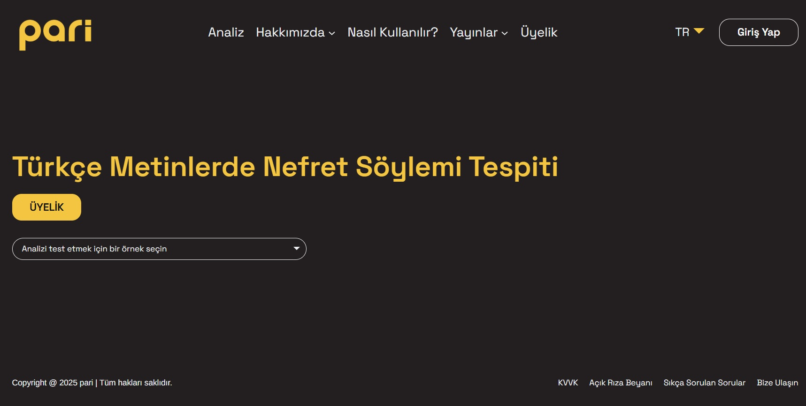

# Hate Speech Detection

**This is the repository for the Hate Specch Detection Project at [Hrant Dink Foundation]( https://hrantdink.org/).**

**Project information:** EU project "Utilizing Digital Technology for Social Cohesion, Positive Messaging and Peace by Boosting Collaboration, Exchange and Solidarity" (EuropeAid/170389/DD/ACT/Multi) by Sabanci University Center of Excellence in Data Analytics and Bogazici University Department of Computer Engineering.

**For more details, please refer to our papers:** 
[SIU2023](https://ieeexplore.ieee.org/document/10223800),
[EACL2024a](https://aclanthology.org/2024.case-1.32/),
[EACL2024b](https://aclanthology.org/2024.case-1.6/),
[LREC2024](https://aclanthology.org/2024.lrec-main.1025/) ,
[arxiv:2502.08266v2](https://arxiv.org/abs/2502.08266v2)

**Models are available at**:
[HuggingFace Link](https://huggingface.co/HrantDinkFoundation)

# pari 
https://pari.hrantdink.org/

The artificial intelligence-supported hate speech detection tool “pari”, developed by the Hrant Dink Foundation in collaboration with Sabancı University and Boğaziçi University, was created in line with the Foundation’s goals of combating discrimination and fostering an inclusive discourse

<!-- 

  

 
-->

